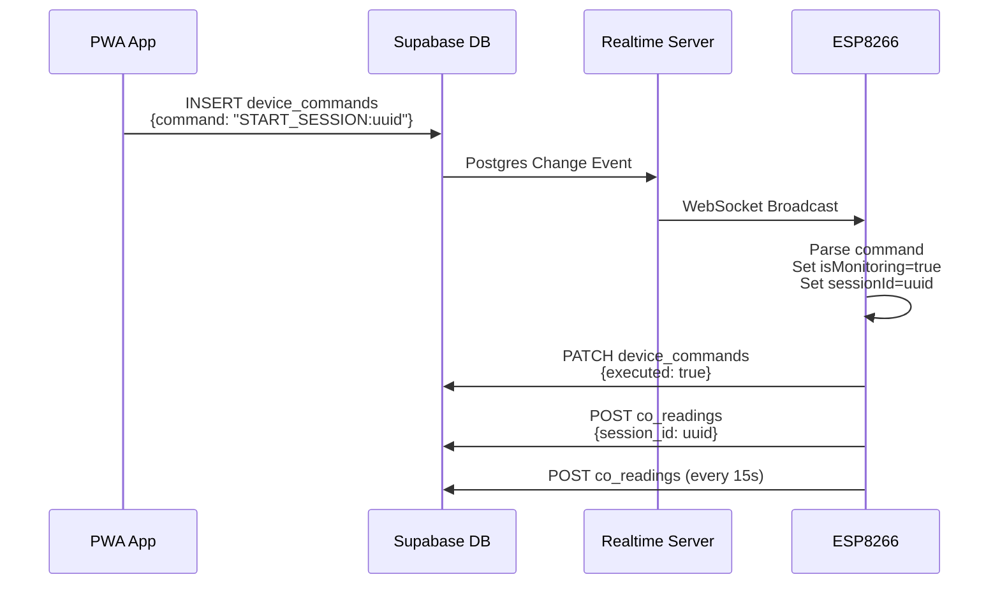
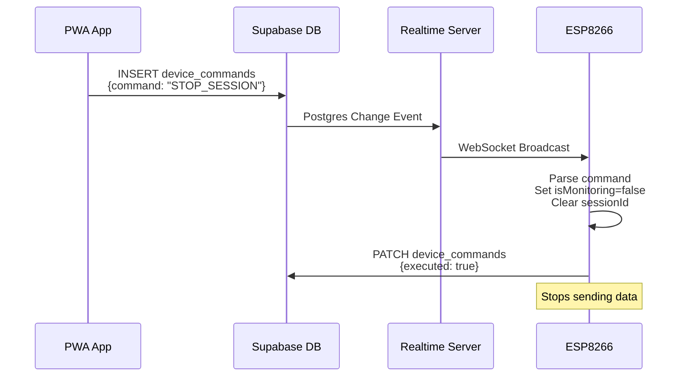

# CO-SAFE Monitor Arduino Code - WebSocket Edition

## 📚 Documentation Index

This directory contains the production-ready Arduino code for the CO-SAFE Monitor with **Supabase Realtime WebSocket support**.

### Quick Access

| Document | Purpose | When to Use |
|----------|---------|-------------|
| **[websocket_handler.ino](./websocket_handler.ino)** | WebSocket module code | Include in your Arduino project |
| **[QUICK_REFERENCE.md](./QUICK_REFERENCE.md)** | 5-minute setup guide | First-time setup or quick lookup |
| **[WEBSOCKET_INTEGRATION_GUIDE.md](./WEBSOCKET_INTEGRATION_GUIDE.md)** | Complete integration guide | Detailed implementation |
| **[arduino-code-final.md](./arduino-code-final.md)** | Original documentation | Understanding the hardware setup |

### Example Sketches

| File | Description | Status |
|------|-------------|--------|
| `CO_SAFE_Monitor-revised-websocket.ino` | Full working example with WebSocket | ✅ Production Ready |
| `CO_SAFE_Monitor-enhanced 1.5.ino` | Enhanced version with resilience | ✅ Production Ready |
| `CO_SAFE_Monitor-backup.ino` | Original HTTP-only version | ⚠️ Legacy (no WebSocket) |

## 🚀 Getting Started (5 Minutes)

### Prerequisites
- ESP8266 (NodeMCU 1.0) board
- Arduino IDE 2.x
- WiFi network access
- Supabase project (free tier works)

### Installation Steps

1. **Install Required Libraries**
   ```
   Arduino IDE → Tools → Manage Libraries
   Search and install:
   - ESPSupabaseRealtime (by RoboKoding)
   - ArduinoJson (v7.0+)
   - Adafruit_SSD1306 (for OLED)
   ```

2. **Download Files**
   - Copy `websocket_handler.ino` to your sketch folder
   - Your main `.ino` file (Arduino IDE auto-includes all `.ino` files)

3. **Configure Credentials**
   ```cpp
   const char* ssid = "YOUR_WIFI_SSID";
   const char* password = "YOUR_WIFI_PASSWORD";
   const char* SUPABASE_URL = "https://xxx.supabase.co/rest/v1/co_readings";
   const char* SUPABASE_API_KEY = "your_anon_key";
   const char* DEVICE_ID = "CO-SAFE-001";
   ```

4. **Add Two Function Calls**
   ```cpp
   void setup() {
     WiFi.begin(ssid, password);
     // ... wait for connection ...
     initializeRealtime();  // ← Add this
   }

   void loop() {
     loopRealtime();  // ← Add this first
     // ... your code ...
   }
   ```

5. **Upload and Test**
   - Flash to ESP8266
   - Open Serial Monitor (115200 baud)
   - Look for "✅ Realtime WebSocket initialized"

## 🏗️ Architecture Overview

```
┌──────────────────────────────────────────────────────────────┐
│                         PWA APP                               │
│  (React 19 + Zustand + Supabase Client)                      │
└────────────────────────┬─────────────────────────────────────┘
                         │
                         ▼
┌──────────────────────────────────────────────────────────────┐
│                    SUPABASE CLOUD                             │
│  ┌────────────────────────────────────────────────────────┐  │
│  │  PostgreSQL Database                                    │  │
│  │  ├─ co_readings (sensor data)                           │  │
│  │  ├─ sessions (monitoring sessions)                      │  │
│  │  └─ device_commands (app → hardware control)            │  │
│  └────────────────────────────────────────────────────────┘  │
│  ┌────────────────────────────────────────────────────────┐  │
│  │  Realtime Server (WebSocket)                            │  │
│  │  └─ Broadcasts INSERT events on device_commands table   │  │
│  └────────────────────────────────────────────────────────┘  │
└────────────────────────┬─────────────────────────────────────┘
                         │
                         ▼
┌──────────────────────────────────────────────────────────────┐
│              ESP8266 ARDUINO (Hardware)                       │
│  ┌────────────────────────────────────────────────────────┐  │
│  │  websocket_handler.ino                                  │  │
│  │  ├─ ESPSupabaseRealtime client                          │  │
│  │  ├─ Listens to device_commands table                    │  │
│  │  ├─ Parses START_SESSION / STOP_SESSION                 │  │
│  │  └─ Manages isMonitoring flag and sessionId             │  │
│  └────────────────────────────────────────────────────────┘  │
│  ┌────────────────────────────────────────────────────────┐  │
│  │  Main Sketch (CO_SAFE_Monitor.ino)                      │  │
│  │  ├─ MQ7 sensor reading (A0)                             │  │
│  │  ├─ MOSFET alarm control (D1)                           │  │
│  │  ├─ OLED display (I2C)                                  │  │
│  │  └─ POST sensor data with session_id                    │  │
│  └────────────────────────────────────────────────────────┘  │
└──────────────────────────────────────────────────────────────┘
```

## 🔄 Command Flow

### Starting a Monitoring Session



### Stopping a Monitoring Session



## 📋 Module Features

### websocket_handler.ino Provides:

✅ **Real-time Command Reception**
- Listens to Supabase Realtime WebSocket
- Filters commands by device_id
- Triggers callbacks on INSERT events

✅ **Session Management**
- Parses START_SESSION:uuid commands
- Validates UUID format (36 characters)
- Maintains session state (isMonitoring flag)

✅ **Command Acknowledgment**
- Sends PATCH request after processing
- Updates executed flag in database
- Provides PWA with execution status

✅ **Auto-Reconnection**
- Detects WebSocket disconnections
- Attempts reconnection every 5 seconds
- Maintains session state during reconnect

✅ **Helper Functions**
- `isCurrentlyMonitoring()` - Check monitoring state
- `getCurrentSessionId()` - Get active session UUID
- `isRealtimeConnected()` - Check WebSocket status

## 🔧 Integration Example

### Minimal Integration

```cpp
#include <ESP8266WiFi.h>
#include <Adafruit_SSD1306.h>

// Global variables required by websocket_handler.ino
const char* SUPABASE_URL = "https://xxx.supabase.co/rest/v1/co_readings";
const char* SUPABASE_API_KEY = "your_anon_key";
const char* DEVICE_ID = "CO-SAFE-001";
WiFiClient client;
Adafruit_SSD1306 display(128, 64, &Wire, -1);

void setup() {
  // WiFi setup
  WiFi.begin("SSID", "PASSWORD");
  while (WiFi.status() != WL_CONNECTED) delay(500);

  // Initialize WebSocket
  initializeRealtime();
}

void loop() {
  // Process WebSocket
  loopRealtime();

  // Read sensor
  float co = readSensor();

  // Send data if monitoring
  if (isMonitoring && currentSessionId != "") {
    sendToSupabase(co);
  }

  delay(1000);
}
```

### Complete Integration

See `CO_SAFE_Monitor-revised-websocket.ino` for a full working example with:
- MQ7 sensor calibration
- MOSFET alarm control
- OLED status display
- Error handling
- WiFi reconnection

## 🐛 Troubleshooting

### Quick Diagnostics

```cpp
void loop() {
  Serial.println("=== Status Check ===");
  Serial.print("WiFi: ");
  Serial.println(WiFi.status() == WL_CONNECTED ? "Connected" : "Disconnected");
  Serial.print("WebSocket: ");
  Serial.println(isRealtimeConnected() ? "Connected" : "Disconnected");
  Serial.print("Monitoring: ");
  Serial.println(isMonitoring ? "Active" : "Inactive");
  Serial.print("Session: ");
  Serial.println(currentSessionId);

  loopRealtime();
  delay(5000);
}
```

### Common Issues

| Symptom | Cause | Solution |
|---------|-------|----------|
| No WebSocket connection | Wrong URL format | Use `https://xxx.supabase.co` without `/rest/v1` |
| Commands not received | Filter mismatch | Verify `device_id=eq.CO-SAFE-001` matches database |
| Session won't start | Invalid UUID | Check UUID is 36 characters with hyphens |
| Data not sending | Monitoring flag false | Verify START_SESSION command received |
| HTTP 401 errors | Invalid API key | Double-check anon key from Supabase dashboard |

### Debug Serial Output

Enable verbose logging:
```cpp
// In websocket_handler.ino, handleDeviceCommand() prints:
// - Raw JSON payload
// - Parsed command
// - Session ID validation
// - Command execution status

// Monitor with: Serial.begin(115200);
```

## 📊 Database Schema

### Required Tables

```sql
-- Device registry
CREATE TABLE devices (
    device_id TEXT PRIMARY KEY,
    device_name TEXT,
    vehicle_model TEXT
);

-- Session tracking
CREATE TABLE sessions (
    id UUID PRIMARY KEY DEFAULT uuid_generate_v4(),
    device_id TEXT REFERENCES devices(device_id),
    started_at TIMESTAMPTZ DEFAULT NOW(),
    ended_at TIMESTAMPTZ
);

-- Sensor data
CREATE TABLE co_readings (
    id BIGSERIAL PRIMARY KEY,
    device_id TEXT REFERENCES devices(device_id),
    session_id UUID REFERENCES sessions(id),
    co_level NUMERIC NOT NULL,
    status TEXT NOT NULL,
    mosfet_status BOOLEAN,
    created_at TIMESTAMPTZ DEFAULT NOW()
);

-- Command channel (app → hardware)
CREATE TABLE device_commands (
    id BIGSERIAL PRIMARY KEY,
    device_id TEXT REFERENCES devices(device_id),
    command TEXT NOT NULL,
    executed BOOLEAN DEFAULT FALSE,
    executed_at TIMESTAMPTZ,
    created_at TIMESTAMPTZ DEFAULT NOW()
);

-- Required indexes
CREATE INDEX idx_co_readings_device_created ON co_readings(device_id, created_at DESC);
CREATE INDEX idx_commands_device_pending ON device_commands(device_id, executed) WHERE executed = FALSE;
```

### RLS Policies

```sql
-- Allow Arduino to write sensor data
CREATE POLICY "Allow anonymous insert on co_readings"
    ON co_readings FOR INSERT
    TO anon
    WITH CHECK (true);

-- Allow Arduino to read/write commands
CREATE POLICY "Allow anonymous access on device_commands"
    ON device_commands FOR ALL
    TO anon
    USING (true);
```

## 🧪 Testing

### Manual Command Test

```sql
-- Test START_SESSION in Supabase SQL Editor
INSERT INTO device_commands (device_id, command)
VALUES ('CO-SAFE-001', 'START_SESSION:550e8400-e29b-41d4-a716-446655440000');

-- Check execution status (should become true after Arduino processes)
SELECT * FROM device_commands WHERE device_id = 'CO-SAFE-001' ORDER BY created_at DESC LIMIT 1;

-- Verify data is being sent
SELECT * FROM co_readings WHERE session_id = '550e8400-e29b-41d4-a716-446655440000' ORDER BY created_at DESC;
```

### Arduino Test Sketch

```cpp
void testWebSocket() {
  Serial.println("\n=== WebSocket Test ===");

  // Test connection
  Serial.print("WebSocket connected: ");
  Serial.println(isRealtimeConnected() ? "YES" : "NO");

  // Test monitoring state
  Serial.print("Monitoring active: ");
  Serial.println(isMonitoring ? "YES" : "NO");

  // Test session ID
  Serial.print("Session ID: ");
  Serial.println(currentSessionId.length() > 0 ? currentSessionId : "NONE");

  Serial.println("=== End Test ===\n");
}
```

## 📖 Further Reading

- **[QUICK_REFERENCE.md](./QUICK_REFERENCE.md)** - API reference and code snippets
- **[WEBSOCKET_INTEGRATION_GUIDE.md](./WEBSOCKET_INTEGRATION_GUIDE.md)** - Complete setup guide
- **[arduino-code-final.md](./arduino-code-final.md)** - Hardware wiring and sensor calibration
- **[architecture.md](./architecture.md)** - System architecture deep dive

## 🔗 External Resources

- [ESPSupabaseRealtime Library](https://github.com/RoboCoding/ESPSupabase)
- [Supabase Realtime Docs](https://supabase.com/docs/guides/realtime)
- [ArduinoJson Documentation](https://arduinojson.org/)
- [ESP8266 Arduino Core](https://github.com/esp8266/Arduino)

## 🆘 Support

If you encounter issues:

1. **Check Serial Monitor** at 115200 baud for debug output
2. **Verify Supabase dashboard** for Realtime connection logs
3. **Test with SQL INSERT** to isolate Arduino vs. PWA issues
4. **Review RLS policies** to ensure Arduino has access
5. **Check WiFi signal strength** and stability

## 📝 Version History

- **v2.0** - WebSocket/Realtime integration (current)
  - Modular websocket_handler.ino
  - Session-aware monitoring
  - Command acknowledgment
  - Auto-reconnection

- **v1.5** - Enhanced resilience features
  - Improved error handling
  - WiFi reconnection logic
  - Sensor calibration

- **v1.0** - Original HTTP-only version
  - Basic REST API integration
  - Manual connect/disconnect

## 🤝 Contributing

When modifying the WebSocket handler:

1. Test with both START_SESSION and STOP_SESSION commands
2. Verify command acknowledgment works
3. Check reconnection logic after WiFi drop
4. Update documentation if API changes
5. Follow Arduino naming conventions

## ⚖️ License

This code is part of the CO-SAFE Connect project. See main repository for license details.

---

**Last Updated:** 2025-11-11
**Arduino IDE Version:** 2.x
**ESP8266 Core Version:** 3.x
**ESPSupabaseRealtime Version:** Latest
